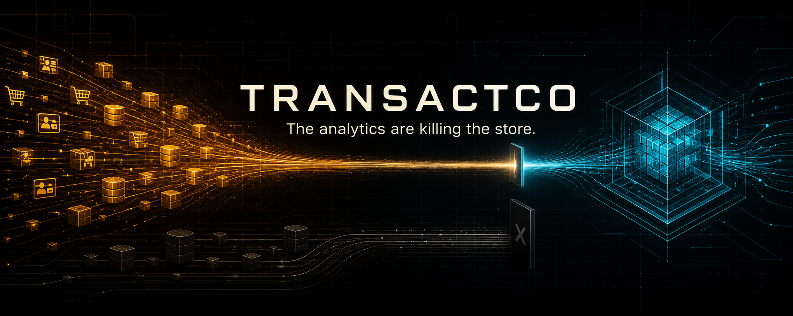

<div align="center">

[](https://github.com/luanmorenommaciel/uc-transact-co)

# TransactCo

**A brownfield analytics system built to be investigated.**

*Postgres runs the store. DuckDB carries the analytical copy. A sealed oracle
knows what broke. You build the system that proves the numbers deserve trust.*

[](https://www.python.org/)
[](https://docs.docker.com/compose/)
[](https://docs.astral.sh/uv/)
[](#-architecture)

Postgres source · DuckDB warehouse · 14 injectable failure modes · isolated
answer key · executable verification

[Quickstart](#-quickstart) ·
[Architecture](#-architecture) ·
[System model](#-system-model) ·
[Failure lab](#-failure-lab) ·
[Command surface](#-command-surface) ·
[Documentation](#-documentation)

</div>

---

## What is TransactCo?

TransactCo is a deliberately realistic e-commerce brownfield. Customers,
products, orders, and payments live in one operational Postgres database. The
store writes transactions while analytical queries compete for the same
resources. The CFO's question sounds simple:

> How much revenue did we make yesterday, and why should I trust that number?

The first half asks for SQL. The second asks for semantics, evidence, system
boundaries, and operational safety.

This repository supplies the runnable source system and the controlled failure
environment. It is the starting point, not the finished analytical product.

| Ships ready | You construct |
| --- | --- |
| Postgres with the source schema applied at boot | Evidence-led investigation and ontology |
| Correlated, time-aware business data | dbt `staging` → `intermediate` → `marts` |
| Postgres → DuckDB read-only landing | Agents that inspect, move, and transform |
| Fourteen injectable failure modes | The incident detector |
| Instructor truth isolated in `_control` | The controlled execution and verification loop |
| Scoring and delivery-verification contracts | Durable documentation, decisions, and learning artifacts |

## ⚡ Quickstart

Requirements: Docker and [`uv`](https://docs.astral.sh/uv/).

```bash
make bootstrap
make status
```

`make bootstrap` creates the environment, installs the dbt adapter, starts and
checks Postgres, generates a clean source dataset, rebuilds the generated DuckDB
warehouse, lands the raw tables, runs unit contracts, verifies isolation and row
parity, and validates the empty dbt shell.

> **Reset boundary:** bootstrap replaces `warehouse.duckdb`. Preserve that file
> before rerunning bootstrap if it contains detector or transformation work you
> care about.

Run `make setup` while network access is reliable. DuckDB downloads its Postgres
extension during setup.

## ◇ Architecture

One direction only: analytical work leaves the operational source; instructor
truth does not.

```text
  POSTGRES
  ├── public.customers ─┐
  ├── public.products  ─┤
  ├── public.orders    ─┼── make land ── read-only ATTACH ──▶ warehouse.duckdb
  └── public.payments  ─┘                                  ├── raw.*        ready
                                                           ├── staging      build
  └── _control.* ── sealed ── ✕ never crosses              ├── intermediate build
                                                           └── marts        build
```

The raw layer is a faithful mirror. If a source defect renames a column, the
renamed column lands. Repairing it silently during extraction would erase the
evidence the investigation is meant to find.

The analytical connection uses `analytics_ro`, which can read `public.*`, cannot
write to the source, and has no access to `_control`.

## ▦ System model

| Entity | Role | Important time |
| --- | --- | --- |
| `customers` | Commercial identity and segment | signup, source lifecycle, ingestion |
| `products` | Catalog, price, cost, availability | source lifecycle, ingestion |
| `orders` | Quantity, captured unit price, discount, status, channel | order time, update time, ingestion |
| `payments` | Payment attempts, amount, method, status | payment time, ingestion |

There are no foreign keys or check constraints. That is intentional: the fixture
must admit orphan references, invalid values, and schema drift. Participants
infer candidate relationships from names and then prove or reject them with
data.

Two clocks matter throughout the system:

- **Business time** describes when something happened in the domain.
- **Ingestion time** describes when the row reached the inspected database.

Substituting one for the other changes the meaning of freshness, late arrival,
and revenue.

## ⚠ Failure lab

The generator can introduce fourteen named conditions without leaking their
mechanics into the analytical path.

**Data quality**

`negative_price` · `missing_customer` · `invalid_quantity` ·
`duplicate_order` · `orphan_payment` · `malformed_data`

**Schema and behavior**

`schema_drift` · `late_arrival` · `volume_spike` ·
`recurring_incident` · `ambiguous_anomaly` · `destructive_fix` ·
`slow_source` · `multi_failure_cascade`

```bash
make inject                       # default scenario, announced
make inject-quiet                 # same operation without revealing what landed
make inject SCENARIO=deep         # a broader scenario
make inject SCENARIO=all          # all registered conditions
make inject DEFECT=schema_drift   # one condition by name
```

Injection is atomic. If the operation fails, or the answer key no longer points
to real affected rows, the transaction rolls back.

One of the fourteen conditions is deliberately ambiguous. Detection quality
therefore depends on meaning and evidence—not only pattern matching.

## ◎ Detector and scoring contract

The detector writes one row per finding into `analytics.detections` inside
DuckDB:

| Column | Meaning |
| --- | --- |
| `detection_id` | Free-form finding or group identifier |
| `defect_type` | Normalized registered condition name |
| `target_table` | `customers`, `products`, `orders`, or `payments` |
| `row_key` | Affected primary key as text, or `NULL` for rowless conditions |
| `evidence` | Human-readable reasoning; retained but not scored |
| `detected_at` | Detection timestamp |

```bash
make score
```

Scoring keeps two questions separate:

- Did the detector identify the right incident family?
- Did it identify the right affected rows?

`make reveal` opens the instructor answer key. Score first.

## ⛨ Oracle boundary

The answer key lives in Postgres under `_control` and is excluded from DuckDB.
Every landing run attempts to read it as `analytics_ro` and proves that access is
denied before copying the four allowlisted source tables.

This is a workflow and analytical-path seal—not an adversarial security boundary
against the owner of the laptop. A genuinely private holdout requires an
instructor-controlled environment or an equivalent context boundary.

## ⌘ Command surface

| Command | Purpose |
| --- | --- |
| `make help` | Show the complete operator surface |
| `make setup` | Create `.env`, install dependencies, pre-warm DuckDB |
| `make bootstrap` | Rebuild and prove a clean foundation fixture |
| `make doctor` | Check Postgres, schema, oracle seal, and extension |
| `make status` | Show source/raw counts and UTC freshness without oracle details |
| `make test` | Run fast executable contracts |
| `make verify` | Prove clean baseline, parity, manifest, and oracle isolation |
| `make dbt-check` | Validate the empty dbt project and DuckDB profile |
| `make seed` | Regenerate the clean operational dataset |
| `make land` | Carry `public.*` into `raw.*` through read-only ATTACH |
| `make psql-ro` | Open Postgres with the analytical read-only role |
| `make query-ro Q="select 1"` | Query DuckDB in read-only mode |
| `make inject` / `make inject-quiet` | Introduce controlled conditions |
| `make score` / `make reveal` | Evaluate findings / open instructor truth |
| `make reset` | Destroy and rebuild the disposable Postgres fixture |

`make reset` destroys the local Docker volume. Never point this teaching fixture
at a non-disposable database.

## ≡ Documentation

| Surface | Audience | Purpose |
| --- | --- | --- |
| [`infra/postgres/init/`](infra/postgres/init/) | Builders | Executable schema, control plane, and role boundaries |
| [`src/transactco/`](src/transactco/) | Builders | Seeder, landing, failure generator, scorer, CLI, and verification |
| [`plan/semana.md`](plan/semana.md) | Facilitators | Storytelling, session design, delivery gates, context pack, and runbook |

Session material — the participant context pack, the facilitation runbook, and
the readiness gates — is consolidated in `plan/semana.md` and distributed by the
facilitator rather than published as repository paths.

The root README spans the complete project and names the failure/scoring
surfaces. For a spoiler-safe foundation investigation, give the agent only the
allowlisted context described in `plan/semana.md`.

## Truth boundaries

- The same seed reproduces generation logic and historical relationships for a
  given seed-time anchor. The partial current date remains time-relative, so
  exact final counts can differ across machines.
- `.env.example` contains local teaching credentials. Nothing in it is suitable
  for production.
- Structural checks prove the encoded fixture contracts. They do not decide the
  business meaning of revenue, refunds, timezone, or late-arrival treatment.
- The dbt directories ship empty intentionally. Transformations, marts, agents,
  and the detector are participant work—not missing implementation.

## Troubleshooting

**Postgres extension unavailable**

Run `make setup` with network access before the live investigation.

**Port 5432 already in use**

Change `POSTGRES_PORT` in `.env`, then run `make up` again.

**Initialization changes are not visible**

Postgres init scripts run only when the Docker volume is created. Use
`make reset` only when the local fixture is disposable.

**The warehouse is stale**

Run `make land && make verify`. Ordinary re-landing preserves
`analytics.detections`; bootstrap intentionally does not.
