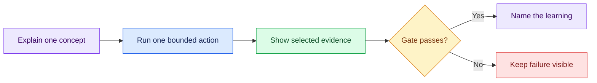

# Live Session Guides

This folder is the executable teaching surface for Semana. The deck introduces
one idea; the repository tests it; the evidence decides whether the sequence
can continue.

Start with [`d1/README.md`](d1/README.md).

## Teaching loop

## Presentation rule

- Explain the diagram and at most three points.
- Paste one prompt or run one command group.
- Show only the evidence named by the checkpoint.
- Do not read complete agent responses aloud.
- Advance only after the gate is visible.

## Safety boundary

- Operational investigation is read-only.
- Durable documents go only to the explicitly authorized file under
  `storage/specs/`.
- Temporary telemetry and skill packages stay under
  `tmp/foundation-investigation/`.
- Do not inspect instructor-control surfaces or run injection, reveal, scoring,
  reset, or source mutations during the live sequence.
- Never put secrets, connection strings, personal data, or complete rows in
  prompts or artifacts.
- Label fallbacks **prepared**.

The planning source is [`../plan/semana.md`](../plan/semana.md); the Day 1
runbook is the operational source for what happens on screen.
