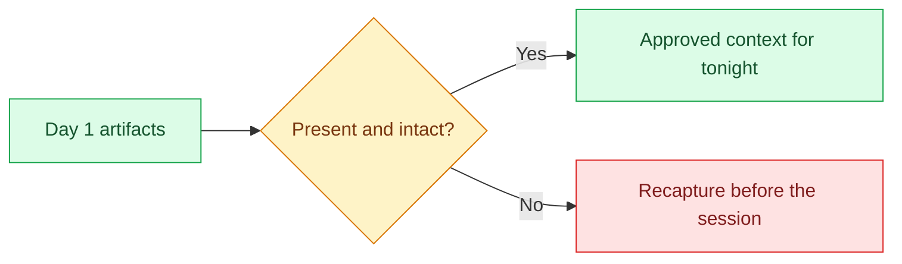

# 00 — Verify the Inheritance

## Session

**No agent.** Use the terminal only.

## Why this step

Day 1 claimed that evidence survives the chat session. Tonight that claim is
either true on screen or the night cannot start: three spec files, four healthy
tables, and a deliberately empty dbt shell that parses.

## Structure



Explain briefly:

- The specs are yesterday's outputs entering as tonight's inputs.
- The dbt shell is empty on purpose — construction lands there tonight.
- `Revenue` is still `unresolved`; nothing tonight changes that.

## Backstage preflight

Run before the audience joins. The specs are per-baseline generated evidence;
if `make bootstrap` was re-run since they were captured, recapture them first
(Day 1 checkpoints 03–06) — numbers from an older baseline must not be shown.

```bash
git status --short
git rev-parse --short HEAD
make doctor
ls -la storage/specs/
test ! -d dbt/models/staging && echo "staging absent — correct"
test ! -e storage/specs/4-plan-transform.md && echo "plans absent — correct"
test ! -d tmp/harness-scaffold && echo "scaffold absent — correct"
git ls-files --error-unmatch AGENTS.md && echo "AGENTS.md tracked — 03 diff will render"
uv run transactco ontology validate
```

The working tree must be clean and `AGENTS.md` must be **committed** before the
session: checkpoint 03's evidence is `git diff AGENTS.md`, which prints nothing
for an untracked file, and any unrelated pending change shows up in the diffs at
03 and 05.

## Do live

```bash
make status
ls -la storage/specs/
make dbt-check
```

Show only:

1. the four entities and their freshness;
2. the three numbered specs and their timestamps;
3. `dbt parse` succeeding against an empty `models/` directory.

Say:

> The session that produced these files is gone. The files are not. That is the
> whole argument for documentation — now we build on top of it.

## Gate

- Environment healthy; four entities visible.
- `1-context.md`, `2-ontology.md`, `3-technical-brief.md` present and readable.
- The dbt shell parses and `dbt/models/staging/` does not exist yet.
- No instructor surface inspected.

## Recovery

```bash
make up
make land
```

If the specs are missing or stale, stop and recapture them via Day 1's
checkpoints — do not substitute prepared copies without labeling them
**prepared**.

Next: [`01-unbounded.md`](01-unbounded.md).
