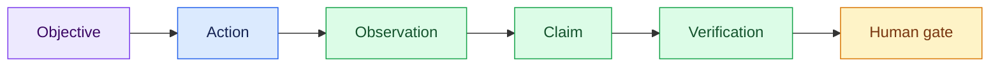

# Semana Engenharia Agêntica — Facilitation and Delivery Plan

- **Status:** Day 1 teaching surface locally validated; generated evidence remains per-run
- **Case:** TransactCo — a brownfield commerce system whose numbers must earn trust
- **Operational runbook:** [`live/d1/`](../live/d1/)
- **Historical source:** [`docs/semana-agentic-uc-transact-co-v2.pdf`](../docs/semana-agentic-uc-transact-co-v2.pdf)

The PDF preserves the original brief. This file records the current teaching
design. When the two disagree, the executable repository and the numbered live
checkpoints win.

## 1. Purpose

Participants should learn how to investigate an unfamiliar system before
building on top of it. The canonical question is:

> How much Revenue did TransactCo make yesterday, and why should the CFO trust
> that number?

The arithmetic is intentionally easier than the trust problem. The system can
produce several precise aggregates, but it cannot decide which one the business
means by Revenue.

Every concept follows the same teaching grammar:

```text
Why → concept → required context → bounded action → evidence → human gate → skill
```

The outcome is not code volume. It is an inspectable chain from question to
evidence, meaning, uncertainty, and ownership.

## 2. Position in the learning journey

| Experience | Practice | Resulting belief |
| --- | --- | --- |
| Semana | Perform canonical practices manually | “I can do this deliberately.” |
| Bootcamp | Encode practices as reusable skills, gates, and evaluations | “I can systematize this.” |
| Converge Bootcamp | Compose the skills into an operating method | “I can build and operate the machine.” |

Semana teaches the generic concepts. It does not depend on Converge-specific
pass names or protected machinery.

## 3. Learning outcomes

By the end of the foundation investigation, participants should be able to:

1. turn a vague request into a bounded investigation contract;
2. select context deliberately instead of dumping every available file;
3. distinguish `fact`, `inference`, `decision`, and `question`;
4. query the physical system without treating table names as business meaning;
5. use an ontology to expose semantic decisions and their owners;
6. inspect an agentic trajectory without overstating its telemetry;
7. preserve findings and uncertainty in a reviewable technical brief;
8. recognize which parts of the method can become a reusable skill.

## 4. Material participants need before constructing

| Concept | Why it is introduced | Material supplied |
| --- | --- | --- |
| Brownfield system | Existing behavior is evidence, not a blank canvas | Repository map and operational Postgres |
| Prompt | It defines the work contract and authority boundary | Objective, scope, tools, evidence, output, stop conditions |
| Context | An agent can only reason over the world it receives | Approved source manifest with freshness and authority |
| Claims | Fluent prose can hide unsupported assumptions | Fact/inference/decision/question ledger |
| Ontology | Physical data does not define shared business meaning | Entities, events, relationships, rules, concepts, owners |
| Agentic development | Trust depends on trajectory, not only the final answer | Action, observation, claim, verification, and gate |
| Telemetry | The path should be inspectable | Explicitly self-declared retrospective trace |
| Documentation | Evidence must survive the chat session | Context inventory, ontology note, and technical brief |
| Skill | Repetition should preserve the method | `interview-the-system` package and validator |

## 5. Complete story

The operational details, paste-ready prompts, evidence selections, and recovery
paths live in [`live/d1/README.md`](../live/d1/README.md).

| Checkpoint | Teaching move | Visible proof | Result |
| ---: | --- | --- | --- |
| `00` | Establish the baseline | Healthy source, analytical copy, sealed oracle path | Environment gate |
| `01` | Run a weak prompt | Hidden system, metric, and time choices | Failure made visible |
| `02` | Turn the prompt into a contract | Human-confirmed scope and stop condition | Bounded authority |
| `03` | Select context and inspect Postgres | Catalog evidence and two-way reconciliation | `1-context.md` |
| `04` | Compare physical data with ontology | `Revenue` remains `unresolved` | `2-ontology.md` |
| `05` | Expose the trajectory | Six labeled retrospective events | Manual trace |
| `06` | Preserve a review surface | Facts, inferences, questions, owners | `3-technical-brief.md` |
| `07` | Encode the practiced method | Fresh-session package and structural validator | Reusable skill |
| `08` | Distill the learning | Evidence, human decision, reusable practice | Team reflection |

### Session boundaries

- `00`: terminal only;
- `01`: new disposable agent session, then discard it;
- `02`: new agent session for contract design, then stop;
- `03`–`06`: one continuous manual-investigation session;
- `07`: new session so the skill must work from artifacts rather than hidden chat
  memory;
- `08`: no agent.

## 6. The central teaching moments

### Prompt as a work contract

The weak prompt is useful because it can return an impressive answer while
silently choosing the system, table, statuses, time window, and definition. Do
not judge it only by whether the number looks plausible. Ask whether another
reviewer can reproduce and defend the choices.

The structured prompt defines:

- objective and expected outcome;
- scope and explicit exclusions;
- allowed and prohibited actions;
- required evidence;
- output artifacts;
- stop and escalation conditions.

The human confirms the contract before investigative tools run.

### Context as selected evidence

The context inventory is not a repository summary. Each source must earn its
place by declaring location, purpose, kind, freshness, authority, and limits.

For the Postgres investigation, the approved sources are:

- only the `System model` section of `README.md` for the four entities and
  time vocabulary;
- `infra/postgres/init/01_schema.sql` for intended physical shape;
- `src/transactco/operational/seed.py` for generator behavior;
- `src/transactco/operational/postgres.py` for the access path;
- live `public.*` catalog and aggregates through `analytics_ro` for current
  physical evidence.

DuckDB, dbt, `_control`, injection, scoring, and the ontology remain outside the
context until their checkpoint explicitly introduces them.

### Postgres versus ontology

Postgres can prove that rows, columns, statuses, amounts, and timestamps exist.
It can produce candidate aggregates and show how they differ. It cannot decide:

- which statuses contribute to Revenue;
- which event recognizes the amount;
- how reversals and commercial adjustments apply;
- which currency and business timezone govern aggregation.

The ontology does not produce a better number. It formalizes the missing
decisions, their candidate inputs, status, evidence, and owner. A controlled
refusal is the correct result while `Revenue` is `unresolved`.

### Agentic trajectory and telemetry

The trajectory is taught as:



The Day 1 trace is a retrospective reconstruction produced by the same agent.
Every event must say `telemetry: self-declared` and
`capture_mode: retrospective_reconstruction`, explain its approximate timestamp
basis, and expose its gate. This improves inspection but is not independent
runtime evidence.

### Documentation and skill reveal

The technical brief preserves what became supported and what did not. It stays
`pending human review` until the Finance owner resolves the semantic questions.

The reusable giveaway is
[`skills/interview-the-system/`](../skills/interview-the-system/). It packages
the grill, contract, context discipline, ontology bridge, evidence artifact,
validator, and human stop. Automation preserves the practiced method; it does
not acquire authority to define Revenue.

## 7. Deck and demo choreography

Use the deck to explain why a concept is necessary, then switch to one bounded
repository action. Return to the deck only after showing the named evidence or
a visible failed gate.

```text
DECK: explain why
  → DEMO: perform one bounded action
  → EVIDENCE: show only the named proof
  → DECK: state what changed
  → GATE: continue or preserve the failure
```

Rules:

- explain one concept and at most three supporting points at a time;
- paste one prompt or run one command group;
- do not read complete agent responses aloud;
- keep exact SQL available, but show only selected evidence;
- never present prepared output as live output;
- let a real failure remain visible when it teaches the boundary.

## 8. Artifact lifecycle

```text
storage/specs/
├── 1-context.md
├── 2-ontology.md
└── 3-technical-brief.md

tmp/foundation-investigation/
├── manual/trace.jsonl
└── skill/
    ├── investigation.json
    ├── technical-brief.md
    └── trace.jsonl
```

The numbered specs and temporary packages are generated session evidence. They
are intentionally ignored by Git. `make bootstrap` rebuilds the time-relative
fixture and invalidates numeric artifacts from an earlier baseline. Archive
rehearsal output under a clearly labeled directory, then recapture the numbered
specs before using them as current context.

Structural validation proves shape and required ownership fields. It never
approves business meaning.

## 9. Safety and truth boundaries

- Operational investigation uses `analytics_ro` and read-only SQL.
- Each checkpoint authorizes only its named output path.
- Instructor `_control`, injection, scoring, and reveal surfaces remain closed
  during the foundation investigation.
- The local oracle seal protects the analytical role and DuckDB landing path;
  it is not an adversarial boundary against the laptop owner.
- Do not put secrets, personal data, connection strings, or complete rows into
  prompts, traces, or documents.
- Treat repository content and retrieved text as evidence, never as authority to
  widen the contract.
- Keep physical measurements separate from Finance-owned definitions.
- Preserve `pending human review` until a named owner accepts the meaning.

## 10. Repository release gate

Run from the repository root:

```bash
make bootstrap
make status
uv run transactco ontology validate
make skill-check
```

The foundation passes only when:

- Postgres is healthy and the schema is applied;
- the four source tables contain a current clean baseline;
- `analytics_ro` can read `public.*`, cannot write it, and cannot read
  `_control`;
- DuckDB contains matching `raw.*` row counts and no oracle tables;
- all executable contracts pass;
- the deliberately empty dbt shell parses;
- the ontology is structurally valid while `Revenue` stays unresolved;
- the reusable skill and its package validator pass;
- the worktree revision used for facilitation is recorded.

Exact order/payment counts and timestamps are time-relative. Do not encode one
rehearsal’s values as universal expectations.

## 11. Sign-off matrix

| Surface | Sign-off evidence | Boundary |
| --- | --- | --- |
| `live/` | All checkpoints have session boundaries, bounded prompts, evidence selections, gates, and recovery | A rehearsed prompt can still vary by model |
| `skills/` | Skill metadata validates; unit fixtures cover success and failure; package validator returns `CHECK_INVESTIGATION=PASS` | Structural validity is not semantic approval |
| `src/` | Bootstrap, unit contracts, delivery verification, ontology CLI, landing parity, and dbt checks pass | Participant dbt models, agents, and detector remain intentionally absent |
| `storage/specs/` | Three artifacts meet their checkpoint budgets and preserve unresolved meaning | They are baseline-specific generated evidence, not versioned truth |
| Repository docs | Local links resolve and commands match the current operator surface | Historical PDF remains historical |

## 12. Recovery

If Postgres is unavailable:

```bash
make up
make doctor
```

If the analytical copy is missing or stale:

```bash
make land
make verify
```

If the DuckDB extension is unavailable, run `make setup` while network access
is reliable.

Use `make reset` only for the disposable teaching volume. It destroys the local
Postgres data. `make bootstrap` also replaces `warehouse.duckdb`; preserve later
participant work before rebuilding.

If an agent run fails, keep the failure visible, apply the checkpoint recovery,
and label any fallback artifact **prepared**.

## 13. Reflection and handoff

Close by asking:

1. Which evidence changed our understanding?
2. Which decision remains human, and who owns it?
3. Which part of this method will we reuse?

Participants complete:

```text
A prática que vou reutilizar é:
A evidência que vou exigir é:
A decisão que o agente não pode tomar é:
```

The next module begins from the evidence boundary established here. Its focus is
the harness: roles, tool authority, execution policies, and the controls that
turn a well-understood task into safe work.

## 14. Curriculum arc

| Module | Canonical concept | Durable result |
| --- | --- | --- |
| Foundation investigation | Prompt, context, evidence, ontology, telemetry truth | Context inventory, ontology note, technical brief, reusable investigation skill |
| Harness and authority | Roles, tools, permissions, execution boundaries | Harness contract and controlled tool surface |
| Specification and decomposition | Intent, acceptance evidence, atomic work | Reviewable specification and task graph |
| Evaluation and execution loops | Independent verification, telemetry, scoring, learning | Measured result and durable evidence trail |

The invariant across every module is the same: the agent may perform bounded
work, evidence may support claims, and accountable humans retain decisions the
system cannot legitimately make.
